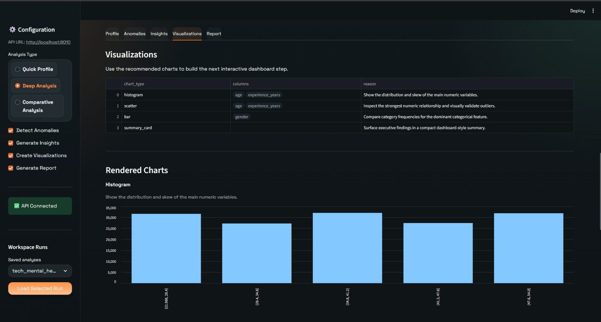
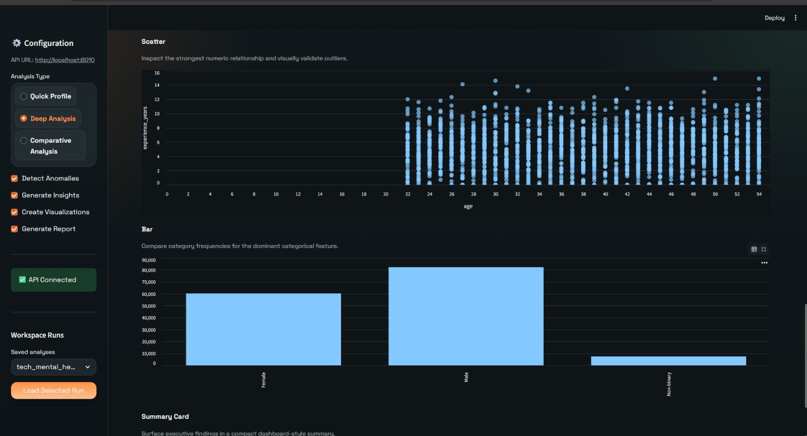
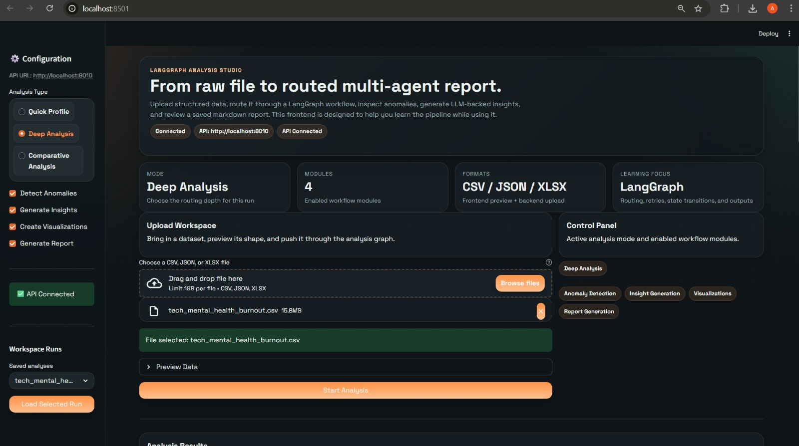
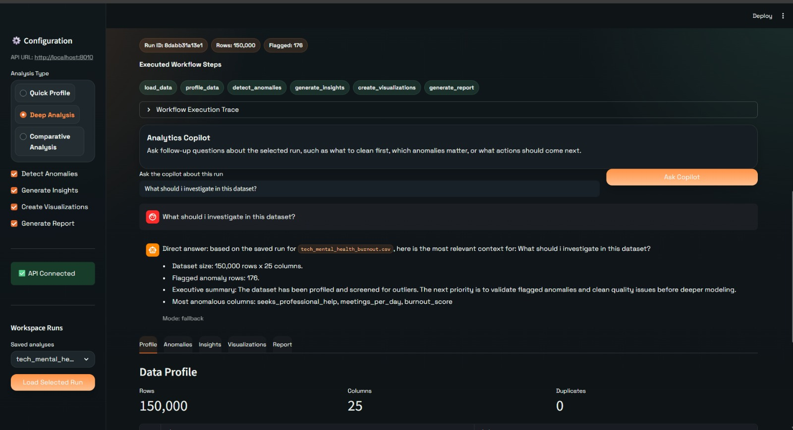

# Self-Service Analytics Copilot

Self-service analytics workspace built with LangChain and LangGraph. Users can upload datasets, run a routed analysis graph, save runs, reopen past analyses, and ask a copilot questions against saved results.

## Why This Project

This project is designed to show how LangChain and LangGraph can be used in a practical analytics product:

- LangGraph controls the workflow, routing, and optional steps
- LangChain powers insight generation, report writing, and copilot Q&A
- Streamlit provides a fast self-service analytics workspace
- FastAPI exposes the backend for analysis runs and saved workspaces

## Screenshots

### Dashboard


### Analysis Results


### Frontend


### Analytics Copilot


## Quick Start

### 1. Install Dependencies
```bash
pip install -r requirements.txt
```

### 2. Configure Environment
```bash
cp .env.example .env
# Edit .env and add your own API keys
```

Required local secrets:
- `OPENAI_API_KEY`
- `PINECONE_API_KEY` if you use Pinecone-backed features later

Important:
- `.env` is local-only and must not be committed
- every contributor should create their own `.env`
- commit only `.env.example`

### 3. Run Streamlit App
```bash
streamlit run streamlit_app.py
# UI runs on http://localhost:8501
```

By default, the app can now run in embedded mode, so Streamlit can execute the workflow without a separate backend.

### 4. Optional: Run Backend API
```bash
python main.py
# API runs on http://localhost:8010 by default
```

If you want the frontend to call FastAPI instead of using embedded mode, set:

```bash
DATA_PIPELINE_MODE=api
DATA_PIPELINE_API_URL=http://localhost:8010
```

If `DATA_PIPELINE_MODE` is unset, the UI will auto-fallback to embedded mode when the API is unavailable.

## Project Structure

```
data-analysis-pipeline/
├── config.py              # Configuration management
├── logger.py              # Logging setup
├── main.py                # FastAPI backend
├── streamlit_app.py       # Streamlit frontend
├── requirements.txt       # Python dependencies
├── .env                   # Environment variables (create from .env.example)
├── .env.example           # Example environment file
├── .gitignore
├── README.md
├── data/
│   ├── uploads/           # Uploaded files
│   ├── outputs/           # Analysis results
│   └── samples/           # Sample datasets
├── agents/                # LangChain agents
│   ├── __init__.py
│   ├── profiler.py        # Data profiler agent
│   ├── anomaly.py         # Anomaly detector agent
│   ├── insight.py         # Insight generator agent
│   ├── visualizer.py      # Visualization agent
│   └── reporter.py        # Report writer agent
├── tools/                 # LangChain tools
│   ├── __init__.py
│   ├── data_loader.py     # Load data from various sources
│   ├── analyzer.py        # Statistical analysis
│   ├── query.py           # Database/API queries
│   └── visualizer.py      # Create visualizations
├── graph/                 # LangGraph orchestration
│   ├── __init__.py
│   ├── state.py           # Define graph state
│   ├── nodes.py           # Graph nodes
│   └── workflow.py        # Build and execute graph
├── logs/                  # Application logs
└── tests/                 # Test files
```

## Architecture

**Data Flow:**
1. User uploads data (CSV, JSON, SQL, API)
2. FastAPI receives file, validates, stores
3. LangGraph orchestrator triggers workflow:
   - Data Profiler Agent (exploration)
   - Anomaly Detection Agent (pattern detection)
   - Insight Generator Agent (deep analysis)
   - Visualization Agent (chart creation)
   - Report Writer Agent (summary generation)
4. Completed runs are saved as workspace records
5. Streamlit reloads prior runs and the copilot answers questions against saved context

**Multi-Agent Pattern:**
- Each agent is specialized and independent
- LangGraph manages state and routing
- Agents communicate via shared state
- Error handling and retry mechanisms built-in

**What To Study In This Repo:**
- `graph/state.py`: shared workflow state and feature flags
- `graph/workflow.py`: conditional routing with `add_conditional_edges`
- `graph/nodes.py`: node implementations and skip nodes
- `agents/insight.py` and `agents/reporter.py`: LangChain prompt chains with retry + fallback
- `agents/copilot.py`: run-aware analytics copilot Q&A
- `services/run_store.py`: saved workspace runs

## GitHub Setup

This repo is safe to publish publicly as long as you do not commit real credentials.

Before pushing:
1. Keep real API keys only in your local `.env`
2. Commit `.env.example`, not `.env`
3. Review changes with `git diff` and `git status`
4. If a key was ever exposed, rotate it immediately

Recommended first push flow:
```bash
git init
git add .
git status
git commit -m "Initial commit"
git branch -M main
git remote add origin <your-repo-url>
git push -u origin main
```

For contributors:
- clone the repo
- copy `.env.example` to `.env`
- add their own API keys
- run the backend and Streamlit locally

Do not commit:
- `.env`
- `.streamlit/secrets.toml`
- API keys in source files
- generated run data in `data/runs`
- uploaded user files in `data/uploads`
- generated outputs in `data/outputs`

## Free Deployment

The simplest free deployment is Streamlit Community Cloud. That gives you a public URL usable on both mobile and desktop browsers.

### Deploy On Streamlit Community Cloud

1. Push this repo to GitHub.
2. Open [share.streamlit.io](https://share.streamlit.io/).
3. Click `New app`.
4. Select your repo and use `streamlit_app.py` as the entry file.
5. Add these app secrets:

```toml
OPENAI_API_KEY = "your_openai_api_key_here"
OPENAI_MODEL = "gpt-4"
DATA_PIPELINE_MODE = "embedded"
MAX_FILE_SIZE_MB = "200"
```

6. Deploy and open the generated public URL on phone or desktop.

Notes:
- `DATA_PIPELINE_MODE = "embedded"` is the recommended free setup because it does not require a second hosted backend.
- Streamlit Cloud storage is ephemeral, so uploaded files and saved runs can reset when the app restarts.
- If you later deploy `main.py` somewhere else, you can switch back to API mode with `DATA_PIPELINE_MODE=api` and `DATA_PIPELINE_API_URL=<your-backend-url>`.

## Contributing

See [CONTRIBUTING.md](./CONTRIBUTING.md) for setup, contribution rules, and pull request guidance.

## License

This project is licensed under the [MIT License](./LICENSE).

## Features

### Implemented
-  LangGraph workflow orchestration
-  File upload and backend analysis flow
-  Data profiling and anomaly detection
-  LangChain-powered insight generation with fallback mode
-  LangChain-powered markdown report generation with saved output
-  Visualization recommendation layer for dashboard planning
-  Saved analysis workspace runs
-  Copilot Q&A against prior analyses

### Next Upgrades
-  Rich chart rendering inside Streamlit
-  Streaming graph execution updates
-  Pinecone-backed retrieval for reusable pattern memory
-  SQL and API data-source connectors

## Open Source Roadmap

Good contribution areas for new collaborators:
- Better chart interactions and filtering
- Streaming graph progress
- SQL/API connectors
- Authentication and user workspaces
- Pinecone-backed memory across runs
- Stronger tests and deployment support

## Learning Resources

### Key Concepts
- **LangGraph**: State machines, node execution, conditional routing
- **LangChain**: Tool calling, chains, memory management, RAG
- **Agents**: Tool use, reasoning loops, error recovery

### Documentation
- [LangChain Docs](https://python.langchain.com/)
- [LangGraph Docs](https://langchain-ai.github.io/langgraph/)
- [OpenAI API](https://platform.openai.com/docs)

## Next Steps

Run Phase 1 verification:
```bash
# 1. Check configuration
python -c "from config import settings; settings.validate(); print('Config OK')"

# 2. Start Streamlit UI
streamlit run streamlit_app.py

# 3. Optional: start API server if you want separate backend mode
python main.py
```

## Notes

- Max file size: 1024MB
- Supported formats: CSV, JSON, XLSX
- Analysis timeout: 5 minutes
- API endpoints documented at `/docs` when running main.py
